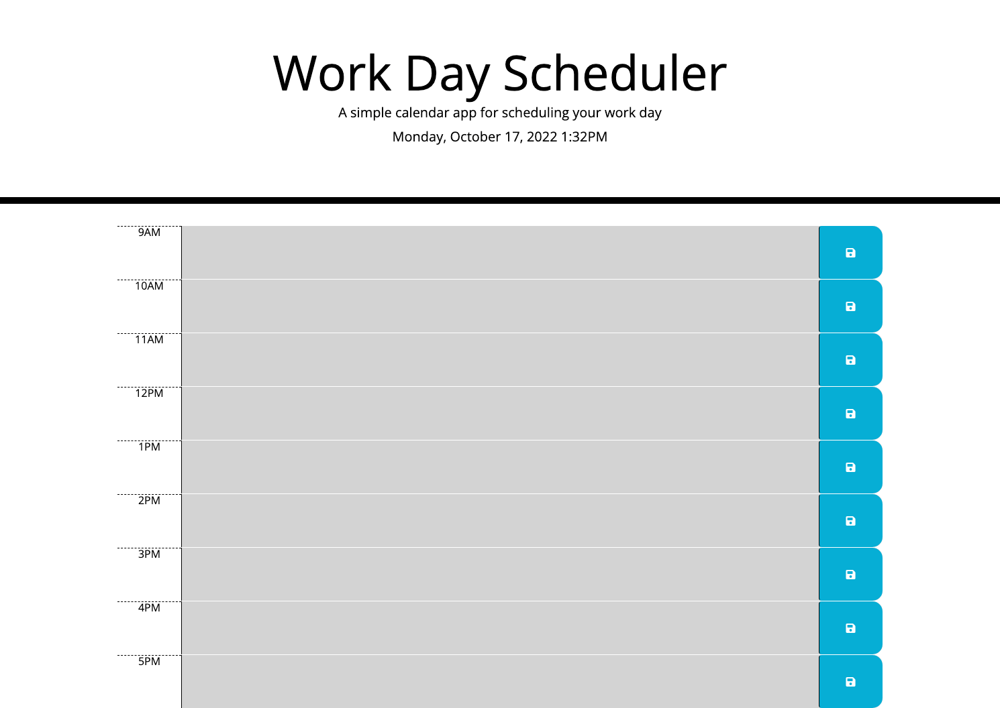

# Daily-Planner

## Description

This challenge was to build a planner for a daily schedule that could be saved and remains after the webpage is refreshed.

- The goal of this project is to use the accumulated knowledge of HTML, CSS, JavaScript, Bootstrap, and JQuery to make this happen.

## Installation

N/A

## Usage

Link for the site: https://rtcottle.github.io/daily-planner/

## Credits

README reference: https://coding-boot-camp.github.io/full-stack/github/professional-readme-guide

day.js guide: https://day.js.org/en/

Error help: https://stackoverflow.com/questions/32027935/addeventlistener-is-not-a-function-why-does-this-error-occur

Jquery local storage tutorial: https://www.youtube.com/watch?v=d4b7iuc3mzI&t=29s

Click events in jQuery: https://api.jquery.com/click/

## License

This project is under the 

## Features

This project updates with the time of day and allows you to plan accordingly.

## Tests

Test this functionality by putting in your events and hitting the save icon on the right. Refresh your browser and see if it persists.
